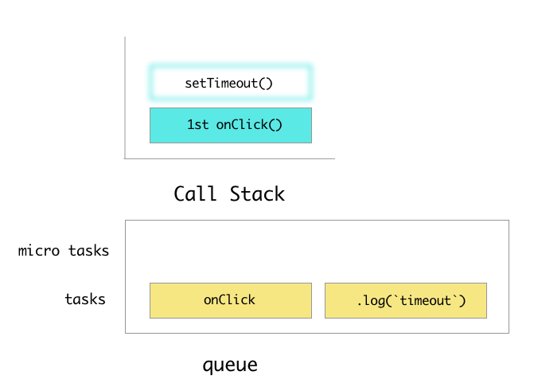

<script src="https://cdn.rawgit.com/google/code-prettify/master/loader/run_prettify.js"></script>
# The Event Loop, promises and async/await

## Learning objectives
- Define Javascript as a single threaded language within the browser
- Explain how javascript functions "run to completion"
- Define "execution context"
- Determine the composition and execution order of the javascript call stack
- Identify the problem that asynchronous program execution solves
- Describe the concurrency model of JS based on the "event loop"
- Give an example of how the message queue is leveraged in javascript.
- Leverage promises to handle asynchronous behavior
- Identify a distinction between tasks and micro tasks.
- Leverage async/await as wrappers for promises

## Framing (2/2)
Asynchronous programming in Javascript can be a pretty daunting hurdle to overcome. When we write/debug async code, problems arise where it can be difficult to even pinpoint where the problem is happening. This workshop is designed to establish a base level understanding of how, and maybe more importantly, **when** javascript code executes within a code base.

## Javascript is single threaded (3/5)
In computer programming, single-threading is the processing of one command at a time. JS is a programming language that is single threaded. Javascript code, in its single threaded nature must "run to completion" within an execution context.

In order to understand the complex nature of asynch program execution, we need to establish a strong foundation in understanding of how JS's synchronous program execution works.

### Discussion exercise 1 - the unknown foundations (10/15)
Try to incorporate within your discussion the following terms or discuss the terms you are unfamiliar with:
- run to completion
- execution context
- call stack

Discuss the following code in your groups:
```javascript
const number = 5 + 5;
console.log(number);
```

## execution context (2/17)
Execution context is defined as the environment in which JavaScript code is executed. The JavaScript engine creates a global execution context before it starts to execute any code(think `main.js` or `script.js`). From that point on, a new execution context gets created every time a function is executed, as the engine parses through your code.

The global execution context is nothing special. It’s just like any other execution context, except that it gets created by default.

In the above example, code is only getting executed within the global execution context.

Let's take a look at another snippet to examine function execution context:

```javascript
function add(num1, num2) {
  return num1 + num2;
}

const number = add(5, 5);
console.log(number);
```

In this snippet, there are five execution contexts that are used. We're already aware of the global execution context of just running this script. The other execution contexts are created on the invocation of the `add`, `.log` methods but also the `+`, `=` operators.

## Call Stack (3/20)
The call stack is a collection of execution contexts.

> The easiest way to conceptualize the call stack and various other components of JS execution is visualizations. Throughout this workshop, there will be visuals to help describe the various mechanisms of JS execution. Assume the snippets are named `main.js`. For clarity, we'll show global context here in this first example, but subsequent examples won't include the global execution context of `main.js`.

Let's take another look at how the following code is executed within the call stack:

```javascript
const number = 5 + 5;
console.log(number);
```

This code happens in milliseconds, but let's get granular and dissect how each part of this code executes. The script(`main.js`) starts and opens the global execution context:


Add operator(`+`) starts:


Add operator(`+`) finishes:


Assignment operator(`=`) starts:


Assignment operator(`=`) finishes:


`console.log` starts:


`console.log` finishes:


Script `main.js` and program finishes:


> For future visualizations, we'll assume some execution contexts like global and others and only highlight the ones in the callstack pertinent to the relevant information.

Through these visualizations we can start to see the single threaded nature of javascript.

### The Problem (5/25)

The problem with single threaded programming is that some processes take a long time. Let's take a look at this [code pen example](https://codepen.io/andrewsunglaekim/pen/RYPLmz)

Now this particular process took an... infinity amount of time. In that time, we couldn't click the button again the gif stopped animating. But we, as developers, constantly need to use things that take an unknown or large amount of time. In the era of UI, even 500ms is far too long to block anything.

We'll dig into why this gif froze later in the workshop.

### The Solution (5/30)

Asynchronous programming. With async programming, we can delegate a `task` to be completed later. Go do this thing, and then when you're done with the thing, we'll tell you what to do next.

### [Concurrency model](https://developer.mozilla.org/en-US/docs/Web/JavaScript/EventLoop)
We can do asynchronous behavior within javascript because of the "event loop". You can think of the "event loop" as an infinite loop that waits until code needs to be run.

Straight from the [mdn docs](https://developer.mozilla.org/en-US/docs/Web/JavaScript/EventLoop#Event_loop)

"The event loop got its name because of how it's usually implemented, which usually resembles:"

```js
while (queue.waitForMessage()) {
  queue.processNextMessage();
}
```

### Discussion exercise 2 - the "event loop" and the queue (5/35)
An easy way to visualize the event loop is through a simple browser event listener.

Try to incorporate within your discussion the following terms or discuss the terms you are unfamiliar with respect to this code
- event loop
- message queue

Discuss the following code: `index.html`:

```html
<button id="demo">Click Me!!</button>
```

`main.js`:
```js
const button = document.getElementById('demo');
button.addEventListener(() => {
  console.log('button clicked!')
})
```

We can examine this code now in the lense of the call stack.

`document.getElementById('demo')` is called:


`document.getElementById('demo')` is finished:


`button.addEventListener()` is called:


`button.addEventListener()` is finished:


And the program is finished. Or is it? What happens if a user clicks my button. How is that callback being executed? The event loop is a constantly running thread. It needs a place to queue up tasks to do. Enter the message queue

### [Message queue](https://developer.mozilla.org/en-US/docs/Web/JavaScript/EventLoop#Queue) (10/45)

It's basically just a list of tasks that need to be processed by the JS thread. MDN really says it best:

> At some point during the event loop, the runtime starts handling the messages on the queue, starting with the oldest one. To do so, the message is removed from the queue and its corresponding function is called with the message as an input parameter. As always, calling a function creates a new stack frame for that function's use.

Let's visualize the call stack now with a message queue assuming our `main.js` has already run. A user clicks our button and queues a task(`console.log()`):


The event loop, after having completed running the initial `main.js`, has it's first message to execute. It's important to note the call stack must be empty in order for a message to be taken off the queue to execute.

In this case, the call stack is empty so the message is immediately read and put onto the call stack:


Then `console.log()` naturally finishes it's execution.

### Run to completion

We mentioned "run to completion" earlier. That fact plays a very important roll in when queued tasks get actually run. Here's the thing, tasks can **only** be run when the call stack is empty. That is to say, if a function hasn't completely "run to completion" yet, a queued task can never be run.

Let's take a look at [this code pen link](https://codepen.io/andrewsunglaekim/pen/RYPjOG) to visualize "run to completion".

```js
for(let i = 0; i < 700000; i++){
  if(i % 500 === 0) console.log(i);
}
```

Depending on the computer, the above code takes roughly a second while dev tools are open. If we were to pour through the logs after clicking several times very quickly, we would see that none of the numbers get mixed up, each function completely finishes before the next message in the task get's queued.

###  JS single threaded but async (2/47)
Even though we say JS as a language is single threaded, browsers and `node.js` are not. Things like `.setTimeout`, `XMLHttpRequest` file I/O are browser or node apis which behaviors are handled outside of the main thread. We can't tie up the main thread with long processes like fetching data or waiting of n milliseconds. Instead, we call functions to defer these processes to browser/node apis. Those apis get plugged back into the main thread through the message queue.

### js promises (3/50)

We can use promises to queue up messages from these various apis.

The Promise object represents the eventual completion (or failure) of an asynchronous operation, and its resulting value.

### Discussion exercise 3 - determining order (10/60)

Let's take the first minute looking at the code alone with the following things in mind:

- eventual completion (or failure) of an asynchronous operation
- how tasks get queued and in which order the tasks get completed
- if you're unfamiliar with the syntax, try to conceptualize the english meanings of the code you see.

```js
const button = document.getElementById('demo');
button.addEventListener('click', () => {
  console.log('1');
  const p = new Promise((resolve, reject) => {
    if (Math.random() > 0.5) {
      console.log('2');
      resolve();
    } else {
      console.log('3');
      reject()
    }
  })
  p.then(() => {
    console.log('4');
  }).catch(() => {
    console.log('5');
  })

  setTimeout(() => {
    console.log('6');
  }, 0)
  console.log('7');
})
```

Now in groups discuss the following:

- What happens on load of this script?
- How many of each number will we see when the button is clicked?
- in what order do the numbers appear when the button is clicked?

<details>
  <summary>The Answer</summary>
  1<br>
  2 or 3<br>
  7<br>
  4 or 5<br>
  6<br>
</details>

#### Here's What happens on the click

First off the click opens an execution context onto the call stack. We won't show this in the visuals ahead, but we won't be able to hit any of our messages until the execution context of the click callback is finished.

`1` is logged:


`1` finishes logging and a `new Promise()` is created:


The following code is an example of an [executor function](https://developer.mozilla.org/en-US/docs/Web/JavaScript/Reference/Global_Objects/Promise#Syntax)

```js
if (Math.random() > 0.5) {
  console.log('2');
  resolve();
} else {
  console.log('3');
  reject()
}
```

[The executor function](https://developer.mozilla.org/en-US/docs/Web/JavaScript/Reference/Global_Objects/Promise#Syntax) of the promise executes as we'd expect through call stack and either `2` or `3` logs. Additionally the promise has already been resolved or rejected at this point.

> It's important to note that normally nested within a `new Promise()` is generally asynchronous code, not synchronous code. However the promises always behave the same once resolved or rejected, IE. queue a task.

`.then` and `.catch` are called to handle the resolution or failure of `p`. At this point, p has resolved or rejected already, so a console.log() becomes queued up. `.then` and `.catch` always return a promise object. In a way you can think of defining them in tandem. You can think of it as Schroedinger's callback. It both is and isn't what happens until the promise finally resolves.

After `.then` and `.catch` get called and define the handlers, Immediately a task gets queued based on the 50/50 roll. For the purposes of this visual, let's say we resolved in the 50/50:


Remember, we can only execute a task in the queue if the call stack is empty. Our call stack, however, is still within the context of the `click` event's callback. Until that's done the event loop can't access the messages in the queue.

So the code moves on to `setTimeout`. [setTimeout is exposed by the browsers `window` object](https://stackoverflow.com/questions/36754971/is-settimeout-a-part-of-javascript-it-self-or-it-is-just-an-api-that-the-browser) It allows us to queue up a task for some later time. In this case 0 ms or the moment after we call `setTimeout` it will queue up the task for another `console.log()`:


Then finally the last `console.log(7)` executes and the clicks execution context has ended.

The messages in the queue are then evaluated in order with either `4` or `5` then `6`.

### Discussion exercise 4 - Rethinking order (5/65)

Let's examine the same code only now let's place the `setTimeout` further up in the code:

```js
const button = document.getElementById('demo');
button.addEventListener('click', () => {
  console.log('1');
  setTimeout(() => {
    console.log('6');
  }, 0)
  const p = new Promise((resolve, reject) => {
    if (Math.random() > 0.5) {
      console.log('2');
      resolve();
    } else {
      console.log('3');
      reject()
    }
  })
  p.then(() => {
    console.log('4');
  }).catch(() => {
    console.log('5');
  })

  console.log('7');
})
```

What is the order in which the logs will appear?

<details>
<summary>The Answer</summary>

The answer is the same as the last answer.
</details>

### [Micro tasks](https://jakearchibald.com/2015/tasks-microtasks-queues-and-schedules/)

Turns out, certain tasks have a higher priority as tasks and get settled before others.

we can visualize the queue as such:


The event loop will always take the top and left most message in the visual queue above. That is to say, the queue will always send micro tasks, if there are any, before regular tasks. In this case, even though `setTimeout` was queued before the promise's task, it was logged later because the promise's task was prioritized

### Discussion exercise 5 - microtask specifics (10/75)

Chat about [this codepen](https://codepen.io/andrewsunglaekim/pen/MqeaVj)

Before we open the log and click the button. Discuss with your group for 3 minutes what the result would be and formulate an answer. After 3 minutes, click the button and discuss why your findings were correct or incorrect for 2 minutes.

Here's the code. `index.html`:

```html
<div id="outter">
  <button id="bob">Click me</button>
</div>
```

```js
const button = document.getElementById('bob');
const outter = document.getElementById('outter');

function onClick() {
  console.log('click');

  setTimeout(function() {
    console.log('timeout');
  }, 0);

  Promise.resolve().then(function() {
    console.log('promise');
  });
}

button.addEventListener('click', onClick);
outter.addEventListener('click', onClick);
```

> there's a difference in the `Promise` used here and the instance of `Promise` used above using the `new` keyword. For the purposes of this code snippet, it's just important to note the callback within `.then` is queued as a micro task.

Read these visualization to gain full clarity on how the above code executes on click.

When the user clicks on  the button, the click event will fire one in succession after the other. Creating an execution context for each `onClick` invocation. Here is the first `onClick` on the call stack and where the first log happens:

> the blurred blue rectangles here represent the action of invoking the function, where as the blurred yellow rectangles represents a message coming off the queue into an invocation on the call stack represented again through blurred blue rectangles. Additionally, for the purposes of simplification `Promise.resolve()` won't be visualized.


`setTimeout` is invoked and queues a task:



`.then` queues up a microtask:


Something interesting happens here. Microtasks can actually be processed between callbacks. Regular tasks have to be run after tasks have run to completion. In the midst of our event propagation (the button click bubbling to its parent div), microtasks like the one sent by our `.then` will be executed. So as soon as the 1st `onClick` comes off the callstack, our microtask gets processed and logs the word "promise":


Tasks do not run between callbacks, so the event bubbles to the div and `onClick` is fired again which logs the second `click` immediately:


`setTimout` is invoked and sets a task to `.log('timeout')`


`.then` queues up a microtask:


The second `onClick()` finishes then the messages in the queue are read in order starting with microtasks:


Then both the `'timeout'` tasks are run as well.

### Bonus - Discussion

What happens if you add `button.click()` to the end of the file.
What will log on page load?

### Thanks

Jake Archibald is a brilliant person and much of this workshop is derived if not stolen directly from his [event loop video](https://www.youtube.com/watch?v=cCOL7MC4Pl0) and [blog post](https://jakearchibald.com/2015/tasks-microtasks-queues-and-schedules/)

Also Philip Roberts, probably stole some stuff from [his video](https://www.youtube.com/watch?v=8aGhZQkoFbQ)

Also, I don't know these dudes, I just think they're awesome and smart.
